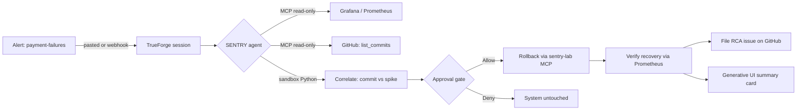

# SENTRY

> An on-call incident responder with a licence to act -- built on [TrueForge](https://github.com/truefoundry/trueforge) for [The Agent Harness Hackathon](https://www.wemakedevs.org/hackathons/trueforge), Aug 24-30 2026.

When a payment-failures alert fires, SENTRY investigates over MCP (Grafana metrics, GitHub deploy history), correlates the cause in an isolated sandbox, then **holds at a human approval gate** before rolling anything back. After recovery it verifies the fix, files an RCA issue, and emits a Generative UI summary card.

## Architecture



## Quickstart

```bash
# 1. Clone and install
git clone https://github.com/instax-dutta/trueforge-sentry && cd trueforge-sentry
pnpm install

# 2. Start the victim shop + observability stack
cp .env.example .env          # fill placeholders
docker compose -f infra/docker-compose.yml up -d

# 3. Start TrueForge (hosted mode)
git clone https://github.com/truefoundry/trueforge && cd trueforge
cp packages/trueforge/.env.example packages/trueforge/.env
docker compose up --build     # serves at http://localhost:8791

# 4. Configure the agent (via TrueForge UI at :8791)
#    - Add Grafana MCP (header auth, pointing at your Grafana instance)
#    - Add GitHub MCP (OAuth or PAT)
#    - Register skills: oncall-triage, payments-escalation
#    - Set model: your OpenAI-compatible gateway

# 5. Run the golden-loop e2e test (requires SSH access to chaos host)
PROM_URL=http://localhost:9090 TF_URL=http://localhost:8791 \
  REMOTE_HOST=you@your-host REMOTE_DIR=~/sentry/infra \
  bash test/e2e-loop.sh
# Note: e2e-loop.sh SSHes to a remote host for chaos injection.
# For local-only testing, run chaos commands manually (see Chaos lab section).
```

## How the demo works

SENTRY runs a 10-step investigation loop:

1. **Classify** the alert (payment-failures, latency, OOM)
2. **Query Prometheus** for error rate and latency percentiles
3. **Compare** against baseline -- state exact numbers from tools
4. **Bisect deploys** -- query GitHub for recent commits, match timestamps against the spike window
5. **Aggregate** in sandbox -- error counts, latency deltas, correlation evidence
6. **Verdict** -- culprit commit SHA, confidence level, evidence list
7. **Approval gate** -- propose rollback via sentry-lab MCP; harness emits `tool.approval_required` and pauses, waits for human Allow/Deny. After Allow, the harness executes the pending call automatically -- no second rollback call needed.
8. **Recover** -- poll Prometheus until error rate returns to baseline
9. **File RCA** -- GitHub issue with timeline, error rates, culprit, PromQL used
10. **Summary card** -- Generative UI streams before/after chart inline in chat

Read-only steps (1-6) run autonomously. The rollback (step 7) and RCA issue (step 9) both trigger approval gates -- the human is in the loop for every irreversible action.

## Skills (hot-loadable)

SENTRY loads playbooks from git-backed SKILL.md files. Skills are attached to the agent via the TrueForge API and can be hot-loaded mid-session:

| Skill | Purpose |
|---|---|
| `oncall-triage` | Base playbook: classify, query, bisect, correlate, propose rollback |
| `payments-escalation` | Extends triage for payment alerts: webhook lag, payment-method breakdown |

Hot-load demo: start with only `oncall-triage` attached, then add `payments-escalation` via API. The next triage visibly includes payment-specific checks. Run `bash test/hot-load-skills.sh` to see it.

## Chaos lab

The victim stack is a controllable chaos lab -- we break it on demand, not wait for a real outage.

```bash
# Inject bad deploy (error rate spikes)
CHAOS_ERROR_RATE=0.5 docker compose -f infra/docker-compose.yml up -d shop

# Restore healthy state
CHAOS_ERROR_RATE=0 docker compose -f infra/docker-compose.yml up -d shop

# Run the full chaos spec (inject -> verify spike -> restore -> verify baseline)
bash infra/chaos/chaos.spec.sh
```

The chaos scripts are deterministic and reversible. Every inject has a matching restore, verified by a Prometheus query returning to baseline.

## What TrueForge handled vs what we wrote

| Component | TrueForge | SENTRY |
|---|---|---|
| Agent runtime, session persistence, context management | Yes | -- |
| MCP tool routing (Grafana, GitHub, sentry-lab) | Yes | -- |
| Approval gate (tool.approval_required) | Yes | Configured `require_approval_for_tools` |
| Subagent fan-out | Yes | Configured `dynamic_sub_agents` |
| Sandbox (Daytona) for code execution | Yes | Configured `sandbox.enabled` |
| Generative UI streaming cards | Yes | Configured `generative_ui.enabled` |
| Skills (git-backed SKILL.md) | Yes | Authored `oncall-triage` + `payments-escalation` |
| Agent manifest (model, instructions, MCP, skills) | Stored via API | Authored `agent.json` fields |
| Victim shop service | -- | Yes (Fastify + prom-client) |
| Observability stack | -- | Yes (Prometheus + Grafana compose) |
| Chaos injection scripts | -- | Yes (inject/restore/chaos.spec.sh) |
| E2e golden-loop test | -- | Yes (test/e2e-loop.sh) |
| Hot-load demo script | -- | Yes (test/hot-load-skills.sh) |

## Project structure

```
trueforge-sentry/
  agent/skills/           SKILL.md playbooks (oncall-triage, payments-escalation)
  app/src/                Victim shop service (Fastify + Prometheus metrics)
  infra/                  Docker compose stack + Grafana dashboards + chaos scripts
  test/                   E2e golden-loop gate + hot-load demo
  docs/                   TDD protocol, ADRs
```

## Testing

```bash
# Golden loop: inject -> triage -> approval -> recovery
PROM_URL=http://localhost:9090 TF_URL=http://localhost:8791 bash test/e2e-loop.sh

# Hot-load demo: skill attachment via API
TF_URL=http://localhost:8791 bash test/hot-load-skills.sh

# Persistence restart: session survives server restart
TF_URL=http://localhost:8791 REMOTE_HOST=you@your-host \
  REMOTE_TF_DIR='~/sentry/trueforge-upstream' bash test/persistence-restart.sh

# Chaos spec: inject + restore + Prometheus verification
bash infra/chaos/chaos.spec.sh
```

## License

MIT
